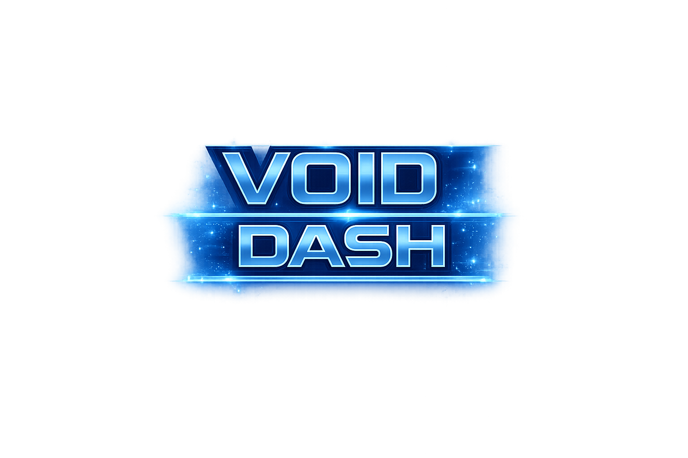

# Void Dash

## [Play the Game!](https://felicthecat.github.io/JS_Space_shooter/)

---

# Description

Void Dash is a 2D space survival game where the player controls a spaceship and must dodge obstacles, asteroids, and survive as long as possible while shooting incoming threats. The game features continuous movement, collision detection, health management.

---

# Main Functionalities

- Player-controlled spaceship movement (up, down, left, right)
- Procedurally spawned obstacles and asteroids
- Shooting lasers with cooldown
- Collision detection between ship, asteroids, obstacles, and lasers
- Health system with visual heart indicators
- Explosion animations on destruction
- Start screen, game screen, and game over screen
- Restart game functionality

---

# Backlog Functionalities

- Score system and high score tracking (to be displayed on gameoverscreen)
- Sound effects and background music
- Difficulty scaling over time
- Power-ups (shield, faster lasers, extra health)
- Extra Weapon types

---

# Technologies used

- HTML
- CSS
- JavaScript
- DOM Manipulation
- CSS positioning and layering

---

# States

- **Start Screen** – Displays game logo and start button
- **Game Screen** – Active gameplay with ship, obstacles, asteroids, and background
- **Game Over Screen** – Displayed when the ship is destroyed with option to restart

---

# Project Structure

### index.html
- Game layout and screen structure
- Script imports

### styles.css
- Game container styling
- Background images
- Screen visibility handling
- Damage flash effect

---

## index.js (Main Game Logic)

- DOM selection and screen management
- `startGame()`
- `gameLoop()`
- `gameOver()`
- `restartGame()`
- `checkCollision(objA, objB)`
    - Collision handlers:
        - `shipVsAsteriod()`
        - `shipVsObstacle()`
        - `lazerVsSteriod()`

- Laser shooting logic
    - fire rate to prevent spaming
- Event listeners for movement and shooting

---

## Ship.js

**Class: Ship**

- Properties:
  - Dimensions
     - `x`, `y`, `w`, `h`
  - `hits`
  - `isDestroyed`
  - `isInvulnerable`

- Methods:
  - `flyUp()`
  - `flyDown()`
  - `flyLeft()`
  - `flyRight()`
  - `shipDestroyed()`

---

## Obstacle.js

**Class: Obstacle**

- Properties:
  - Dimensions
     - `x`, `y`, `w`, `h`
  - `speed`

- Methods:
  - `automaticMovement()`

---

## Asteriods.js

**Asteroid Types**

- Medium Asteroids:
  - `AsteriodMediumRight`
  - `AsteriodMediumTop`
  - `AsteriodMediumBottom`

- Small Asteroids:
  - `AsteriodSmallRight`
  - `AsteriodSmallTop`
  - `AsteriodSmallBottom`

**Shared Properties**

- Dimensions
    - `x`, `y`, `w`, `h`
- `speed`
- `isDestroyed`

**Methods**
- `automaticMovement()`
- `destroy()`

---

## Planet.js

**Class: Planet**
- Decorative background object

- Properties:
    - Dimensions
     - `x`, `y`, `w`, `h`
  - `speed`

- Methods:
  - `automaticMovement()`

---

## Lazer.js

**Class: Lazer**
- Properties:
  - Dimensions
     - `x`, `y`, `w`, `h`

  - `speed`

- Methods:
  - `automaticMovement()`

---

# Extra Links

### Sketch
[Link](https://www.figma.com/design/ReXyIrOUCIp3tssaSX8SxI/Void-Dash?node-id=0-1&p=f&t=jeVgefPJUWXs6yuQ-0)

### Slides
[Link](www.your-slides-url-here.com)

---

## Deploy
[Link](www.your-deploy-url-here.com)
